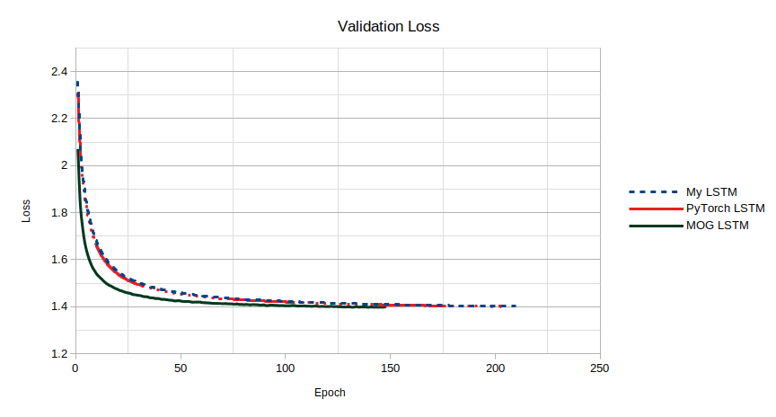

# Mogrifier LSTM

This repository implements an LSTM from scratch in PyTorch (allowing PyTorch to handle the backpropagation step) and then attempts to replicate the [Mogrifier LSTM paper](https://arxiv.org/abs/1909.01792). The code can be run locally or in Google Colaboratory.

## Mogrifier LSTM Results

I tested text prediction using the Brown corpus dataset (more info in the notebook) and saw **earlier convergence results and slightly better validation loss**. To further verify these results, we need to test against more datasets and more neural network architectures. Checkpoints and metrics have been saved for each LSTM type per epoch (see run folder); I didn't CM the tensorboard event logs as they are huge, but you can get most of the same information just looking at the JSON metric files. A summary of the results I got can be seen below:



### My LSTM (made from scratch)

*automatic early stopping never reached criteria for stop*

<pre><code>
 'best_epoch': 207,
 'training_epochs': 209,
 'epoch': 209,
 'training_loss': 1.3781935724280996,
 'training_cpu_memory_MB': 2750.236,
 'training_gpu_0_memory_MB': 952,
 'validation_loss': 1.401858257619958,
 'best_validation_loss': 1.4012448003417568}
</code></pre>

### Official PyTorch LSTM (must faster run time)

*automatic early stopping used*

<pre><code>
 'best_epoch': 197,
 'training_epochs': 203,
 'epoch': 203,
 'training_loss': 1.3790437656746815,
 'training_cpu_memory_MB': 2751.964,
 'training_gpu_0_memory_MB': 1014,
 'validation_loss': 1.4007186230860258,
 'best_validation_loss': 1.4002491518070823
</code></pre>

### Mogrifier LSTM (used my LSTM and then added improvements)

*automatic early stopping used*

<pre><code>
 'best_epoch': 141
 'training_epochs': 147,
 'epoch': 147,
 'training_loss': 1.3751222530060265,
 'training_cpu_memory_MB': 2771.636,
 'training_gpu_0_memory_MB': 1115,
 'validation_loss': 1.401227615381542,
 'best_validation_loss': 1.3973440904366343
</code></pre>

*Note on Mogrifier results: The Mogrifier LSTM paper claimed they would release their own code, but this has yet to happen (paper was released in September 2019). When that code is available, it should be at https://github.com/deepmind/lamb .*

## Local Install

Recommended you use Python `3.7`.
You will need to make sure that your virtualenv setup is of the correct version of python.
We will be using *PyTorch*.

Please see below for executing a virtual environment.

```shell
cd MogrifierLSTM
pip3 install virtualenv # If you didn't install it
virtualenv -p $(which python3) ./venv_lstm
source ./venv_lstm/bin/activate

# Install dependencies
pip3 install -r requirements.txt

# View the notebook

# Deactivate the virtual environment when you are done
deactivate
```

### Working with IPython Notebook

To view the notebook, simply run the following command to start an ipython kernel.

```shell
# add your virtual environment to jupyter notebook
python -m ipykernel install --user --name=venv_lstm

# port is only needed if you want to work on more than one notebook
jupyter notebook --port=<your_port>

```

and then work on the `MogrifierLSTM.ipynb` notebook.
Check the python environment you are using on the top right corner.
If the name of environment doesn't match, change it to your virtual environment in "Kernel>Change kernel".

## Cloud Install (Google Colaboratory)

1. Head over to [Google Colab](https://colab.research.google.com/). It is recommended that you switch to a GPU notebook as things will usually run a little faster that way. There are instructions for this on the colaboratory site.
2. Download the .ipynb file in this repository
3. Upload that file to Google Colabatory and run from there!

**Note: Google Colaboratory has time limits for their systems, so you may not be able to fully train the Mogrifier LSTM on their system without some special effort.**
